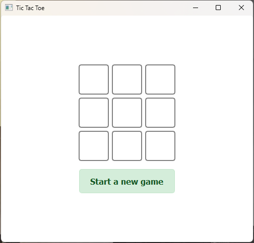

# Tic Tac Toe

A simple single player Tic Tac Toe game against a computer that uses a heuristic approach to determine its moves.



### Game Heuristics
1) Win: If the AI can win in the current move, it should do so.
2) Block: If the opponent can win in the next move, the AI should block it.
3) Center: Take the center square if available.
4) Opposite Corner: If the opponent is in a corner, take the opposite corner.
5) Empty Corner: Take any of the available corners.
6) Empty Side: Take any of the available sides.

## Installation

### Prerequisites

- Python 3.x
- PyQt5

### Steps

1. Clone the repository:
    git clone https://github.com/thisIsRasel/tic-tac-toe

2. Navigate to the project directory:
```cmd 
    cd tic-tac-toe
```

3. Install the required packages:
```cmd
    pip install -r requirements.txt
```
### Usages
1. Run the main.py file from src folder:
```cmd
    python .\src\main.py
```
2. The game window will open. Click on the buttons to make your move.
3. Click on "Star a new game" button to restart the game